<!--
  Himanshu Chandela - GitHub profile README
  Theme "Aurora Glass": #7C5CFF violet, #22D3EE cyan, #F472B6 pink, #34D399 mint

  The four animated SVGs in ./assets are hand-written and self-contained (no JS,
  no external fonts), so they animate on GitHub. Edit colours there.
  Everything else is a live badge/card service - notes are left inline.
-->

<div align="center">
  
</div>

<div align="center">
  <a href="https://github.com/transmogrify-cell">
    
  </a>
</div>

<div align="center">
  <sub>Software Engineer &mdash; deep learning with TensorFlow / Keras, algorithms in C++. Knight @ LeetCode, Specialist @ Codeforces.</sub>
</div>

<div align="center">
  <a href="#-stack"></a>
  <a href="#-stats"></a>
  <a href="#-competitive"></a>
  <a href="#-projects"></a>
  <a href="#-connect"></a>
</div>

<div align="center">
  
  
  
</div>


<a id="-stack"></a>

## &nbsp;&nbsp;`01`&nbsp;&nbsp;Tech Stack

<div align="center">
  
</div>

<div align="center">

**Languages**


**Machine Learning**


**Tools**


</div>


<a id="-stats"></a>

## &nbsp;&nbsp;`02`&nbsp;&nbsp;GitHub Stats

<div align="center">
  
  
</div>

<div align="center">
  
  
</div>

<div align="center">
  
</div>

### &nbsp;&nbsp;Pac-Man is eating my contributions

<!--
  Generated daily by .github/workflows/pacman.yml (abozanona/pacman-contribution-graph)
  and pushed to the `output` branch. The images 404 until that workflow runs once:
  GitHub -> Actions -> "generate pacman contribution graph" -> Run workflow.
-->
<div align="center">
  <picture>
    <source media="(prefers-color-scheme: dark)" srcset="https://raw.githubusercontent.com/transmogrify-cell/transmogrify-cell/output/pacman-contribution-graph-dark.svg" />
    <source media="(prefers-color-scheme: light)" srcset="https://raw.githubusercontent.com/transmogrify-cell/transmogrify-cell/output/pacman-contribution-graph.svg" />
    
  </picture>
</div>


<a id="-competitive"></a>

## &nbsp;&nbsp;`03`&nbsp;&nbsp;Competitive Programming

<table>
<tr>
<td width="52%" valign="top" align="center">

<!-- LeetCode card - theme options: dark, nord, unicorn, forest, wtf -->
<a href="https://leetcode.com/u/cogentHeisnberg/">
  
</a>

</td>
<td width="48%" valign="top">

<div align="center">

**Codeforces**

<!--
  The two live Codeforces badges (RATING / MAX) were removed because they read
  the Codeforces API for the handle `transmogrify-cell`, which does not exist
  there, so they rendered as INVALID. Swap HANDLE below for your real handle
  and uncomment to bring them back.

  
  
-->


**LeetCode**


</div>

```cpp
// the loop that does all the work
while (problems--) {
    solve();
    ++rating;
}
```

</td>
</tr>
</table>


<a id="-projects"></a>

## &nbsp;&nbsp;`04`&nbsp;&nbsp;Projects

<table>
<tr>
<td width="50%" valign="top">

### CAPTCHA OCR &mdash; CRNN + CTC

An end-to-end CAPTCHA reader: a convolutional encoder feeds stacked bidirectional
LSTMs, trained with **CTC loss** so the model learns to read variable-length text
without per-character labels.

- `70 x 25` grayscale inputs, greedy CTC decoding
- Custom `CTCLayer`, early stopping on validation loss
- Built on Keras 3 / TensorFlow, trained in Colab


<a href="./Untitled8.ipynb"></a>
<a href="https://colab.research.google.com/github/transmogrify-cell/transmogrify-cell/blob/main/Untitled8.ipynb"></a>

</td>
<td width="50%" valign="top">

### On the workbench

- **Sequence models beyond OCR** &mdash; handwriting and scene text.
- **A competitive-programming notes repo** &mdash; patterns, templates and the
  traps I keep falling into.
- **This profile** &mdash; the animated SVGs in [`/assets`](./assets) are
  hand-written: no JavaScript, no external fonts, pure SVG + CSS.

<!--
  ADD A PROJECT - copy this into the table above:

  ### Project name
  One or two lines on what it does and why it is interesting.
  
  <a href="https://github.com/transmogrify-cell/REPO"></a>

  Or drop in a live repo card:
  <a href="https://github.com/transmogrify-cell/REPO">
    
  </a>
-->

<div align="center">
  <a href="https://github.com/transmogrify-cell?tab=repositories">
    
  </a>
</div>

</td>
</tr>
</table>


<a id="-connect"></a>

## &nbsp;&nbsp;`05`&nbsp;&nbsp;Connect

<div align="center">

<a href="https://github.com/transmogrify-cell"></a>
<a href="https://www.linkedin.com/in/himanshu-chandela-5947a6212/"></a>
<a href="https://leetcode.com/u/cogentHeisnberg/"></a>
<a href="https://codeforces.com/profile/transmogrify-cell"></a>
<a href="https://x.com/transmogrify_cell"></a>
<a href="mailto:hello@example.com"></a>

</div>

<!--
  EDIT THESE THREE THINGS
  1. mailto:hello@example.com              -> your real address
  2. linkedin.com/in/... and x.com/...     -> your real handles
  3. Everything else assumes the username `transmogrify-cell`; a find-and-replace
     on that one string updates every card, badge and link at once.
-->

<div align="center">
  
</div>
